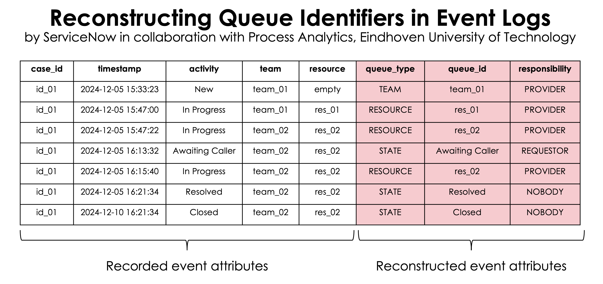
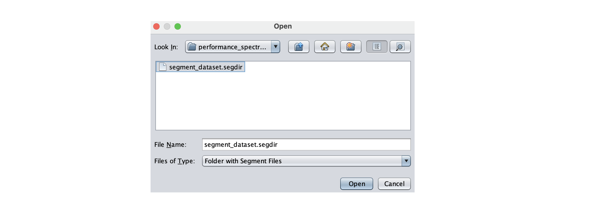
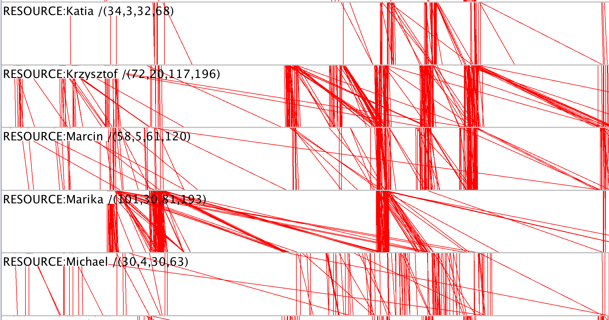

# Queue Reconstruction Tool

## 1. Overview

The Queue Reconstruction Tool (QRT) is a command line tool for demonstrating the queue reconstruction approach described in paper "Reconstructing Events of Processes with Queues" (to be submitted to the BPM conference).

The QRT: 
* imports an event log where each event has a case identifier, activity name, timestamp, team (group) identifier, and resource identifier, and
* uses a provided responsibility map to reconstruct the team and resource queue identifiers for each event. 

Additionally, the QRT allows us to 
* evaluate the queue reconstruction method, proposed in the paper, by generating a synthetic event log of the ITSM Incident process, reconstructing its queue, and comparing the reconstructed queue identifiers with the ground truth of the input synthetic log, and
* reconstruct queue information in the BPI Challenge 2013 Incident event log.

## 2. How to Install

### 2.1. Prerequisite: Java 11 or Higher

The QRT is implemented and tested using Java 11.

1. Install the most recent JRE 11 (or JDK 11 if you want to build the tool from sources)
1. Ensure that a correct version of Java is configured: run `java -version` in the command line. You should get the following (or similar) response:

`openjdk version "17.0.10"`

If you want to build the tool, install maven as well: https://maven.apache.org/

### 2.2. Building the QRT from sources

1. Clone the repository
2. Run `mvn clean package` in the root directory of the repository
3. The executable jar file `queue-reconstruction-tool-1.0-SNAPSHOT-jar-with-dependencies.jar` will be created in the `target` directory

## 3. Getting Started

You can use this tool in the following scenarios:

1. Evaluate the approach proposed in the paper
2. Reconstruct the queues for the BPI Challenge 2013 Incident event log and generate its performance spectrum for exploring it in the Performance Spectrum Miner (PSM) https://github.com/processmining-in-logistics/psm
3. Import an event log in the CSV format and reconstruct queues 

We consider these scenarios in the following.

### 3.1. Evaluating the Approach

In this scenario, the QRT generates a log of the ITSM Incident process with known queue identifiers, i.e., the ground truth, reconstructs the queue identifiers using the approach, and checks the result for errors.
Each mismatching queue identifier is considered one error.

The tool requires the following input:
`<path> <traceNumber> <maxDurationMs> <maxEventNumber> <teamNumber> <resourceInTeamNumber> <seed>`, where
* `<path>` is the path to the output directory
* `<traceNumber>` is the number of traces in the generated log
* `<maxDurationMs>` is the maximum duration of a process step in milliseconds
* `<maxEventNumber>` is the maximum number of events in a trace
* `<teamNumber>` is the number of teams in the process
* `<resourceInTeamNumber>` is the number of resources in each team
* `<seed>` is the seed for the random number generator.

Example:
`java -cp ./target/queue-reconstruction-tool-1.0-SNAPSHOT-jar-with-dependencies.jar com.servicenow.processmining.queue.experiments.reconstruction.synthetic.EvaluationTool . 1000 1000000 15 100 100 0`

Output: `Error count: 0`
This output means that the queue reconstruction approach has not made any errors in the queue reconstruction.
The synthetic log is recorded in `initial_log.csv`, and the reconstructed log is recorded in `reconstructed_log.csv` in the output directory.

### 3.2. Reconstructing the BPI Challenge 2013 Incident Event Log

First, download the BPI Challenge 2013 Incident event log https://data.4tu.nl/file/0fc5c579-e544-4fab-9143-fab1f5192432/aa51ffbb-25fd-4b5a-b0b8-9aba659b7e8c on page https://data.4tu.nl/datasets/0fc5c579-e544-4fab-9143-fab1f5192432
    
Then, run the following command (providing the correct path to the log and the output directory):

`java -cp ./target/queue-reconstruction-tool-1.0-SNAPSHOT-jar-with-dependencies.jar com.servicenow.processmining.queue.examples.bpic.BpicIncidentQueueReconstructionTool ./BPI_Challenge_2013_incidents.xes.gz ./output`

After executing this command, the tool will generate the reconstructed log `bpic_reconstructed_log.csv` in the CSV format in the `output` directory, and the files to be imported in the Performance Spectrum Miner in the `output/performance_spectrum` directory.

To explore the performance spectrum, use the PSM to import these files. Choose `Folder with segment files' in the import dialog of the PSM:

An example of the performance spectrum of the agent queues is shown below.

**Disclaimer.** 
We supported the BPI Challenge 2013 Incident event log for demonstration purposes only. 
We did not validate if the results were correct due to the lack of domain knowledge. 
Moreover, we do not know how accurate the recorded information on the team and resource assignment is. 

### 3.3. Importing and Reconstructing an Event Log

Finally, it's possible to reconstruct an event log if all the required information is presented.
An event log must contain the following attributes for each event: case identifier, timestamp, activity label, team identifier, and resource identifier. Their columns must be ordered in the CSV file accordingly.
The tool expects the following timestamp format: `yyyy-MM-dd HH:mm:ss`.

To import and reconstruct an event log, run the following command:

`java -cp ./target/queue-reconstruction-tool-1.0-SNAPSHOT-jar-with-dependencies.jar com.servicenow.processmining.queue.experiments.reconstruction.log.QueueReconstructionTool ./input/initial_log.csv ./input/responsibilities.json ./output/reconstructed_log.csv`

The first argument is the path to the input log, the second argument is the path to the responsibility map (see the paper for more detail), and the third argument is the path to the output directory.
Event log example:

|`case_id`|`timestamp`|`activity`|`team`|`resource`|
|---------|-----------|---------|------|----------|
|`5`|`2024-12-05 15:33:23`|`New`|`team_17`|`EMPTY`|
|`5`|`2024-12-05 15:47:00`|`InProgress`|`team_62`|`EMPTY`|

Responsibility map example:

`{
  "AwaitingCaller" : "REQUESTOR",
  "Resolved" : "NOBODY",
  "Closed" : "NOBODY",
  "EMPTY" : "PROVIDER",
  "New" : "PROVIDER",
  "Cancelled" : "NOBODY",
  "InProgress" : "PROVIDER",
  "AwaitingProblem" : "TASK"
}`

## 4. Source Code

The table below shows the package structure of the QRT.

| Package                                                                   | Description                                                           |
|---------------------------------------------------------------------------|-----------------------------------------------------------------------|
| `com.servicenow.processmining.queue`                                      | The approach implementation                                           |
| `com.servicenow.processmining.queue.experiments.io`                       | Import and export of event logs in different formats                  |
| `com.servicenow.processmining.queue.experiments.simulation`               | Synthetic log generator                                               |
| `com.servicenow.processmining.queue.experiments.reconstruction.synthetic` | Evaluation using synthetic logs                                       |
| `com.servicenow.processmining.queue.experiments.reconstruction.log`       | Evaluation using imported logs                                        |
| `com.servicenow.processmining.queue.examples.bpic`                        | BPI Challenge 2013 Incident log reconstruction and export for the PSM |
| `com.servicenow.processmining.queue.examples.bpic.io`                     | The PSM  specific export                                              |
| `com.servicenow.processmining.queue.examples.bpic.io`                     | The PSM  specific export                                              |

